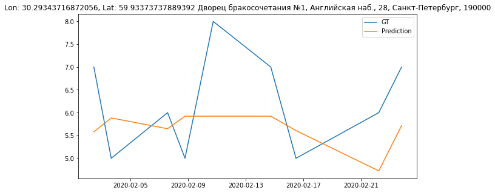

# ML-in-IndustryLabs
Laboratory works for ITMO course "ML in Industry"

# Team
* Maxim Ryazanov J42322c
* Nikita Kulin J42322c
* Aleksandr Voskresenskii J42332c

# Tasks
* LW1 - Number of posts prediction for geo-regions of St.Petersburg
* LW2 - Multimodal movie genre classification

# Example of work for LW1

